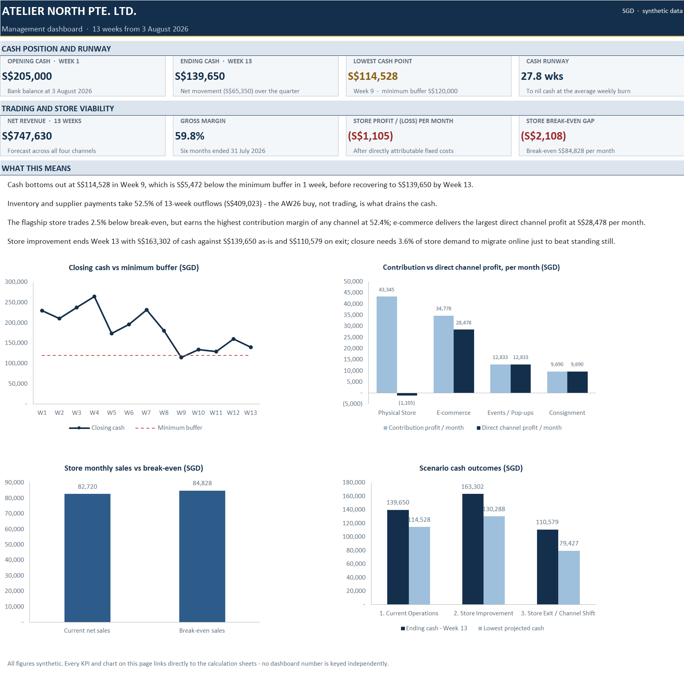
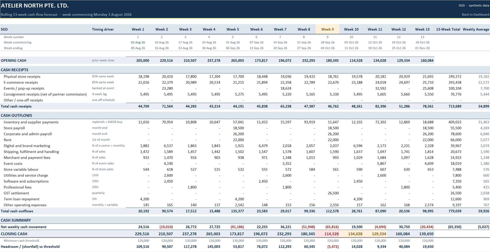
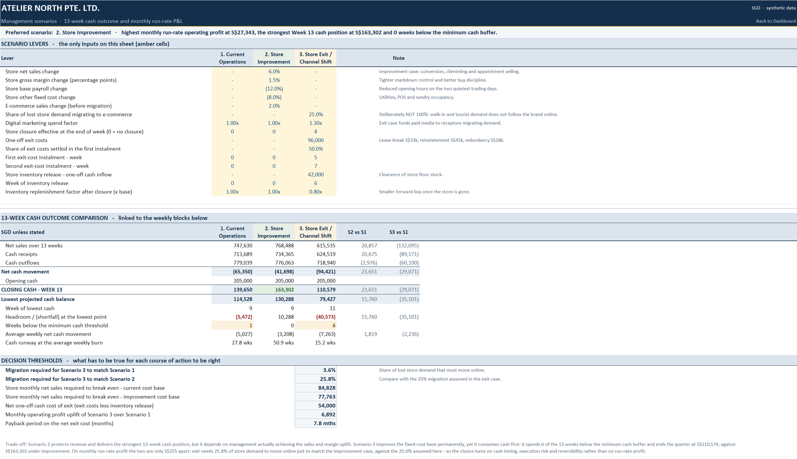
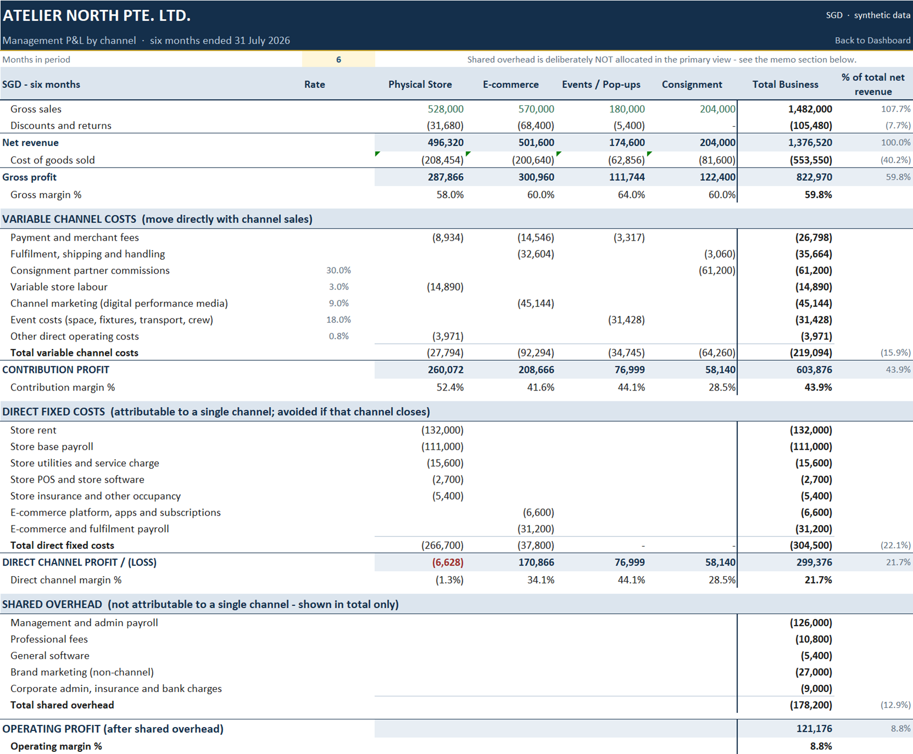
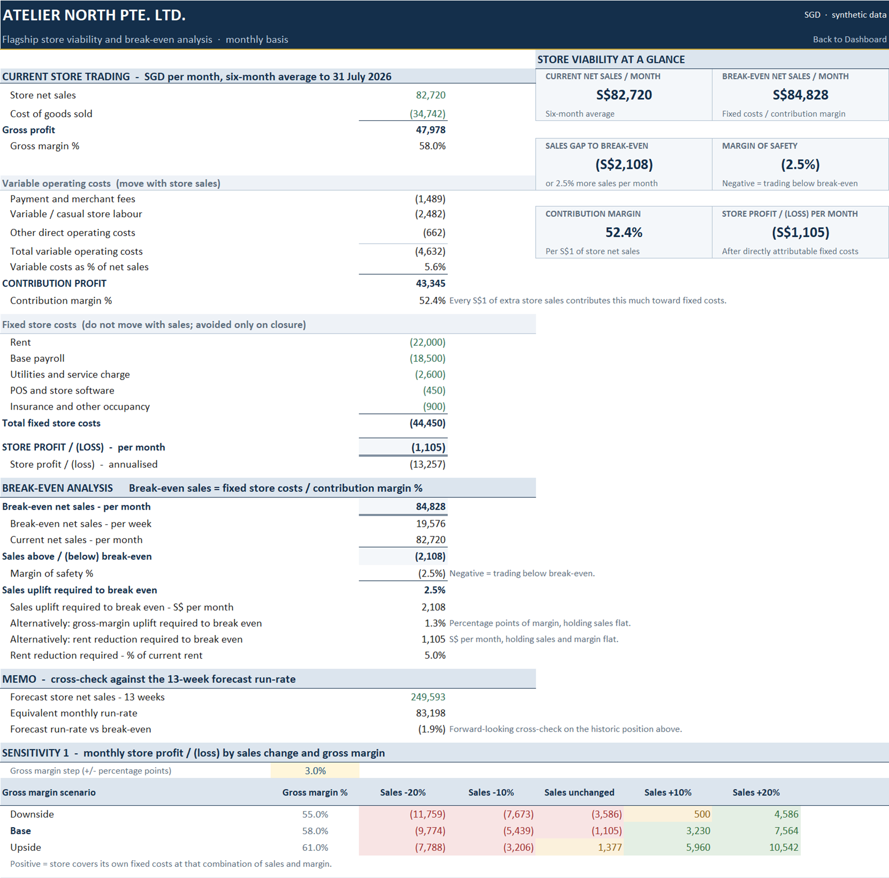
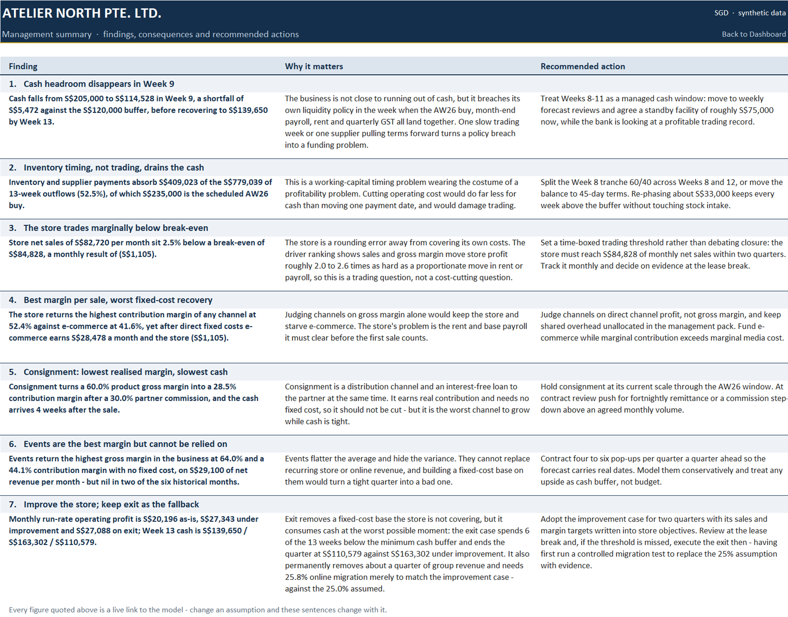
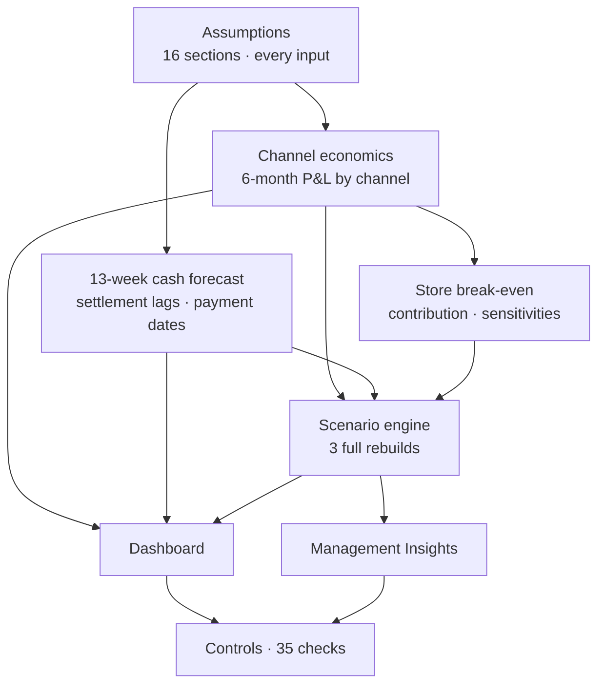

# Retail FP&A Cash Flow & Decision Model

13-week liquidity forecasting, channel profitability, break-even analysis and management scenario modelling for a synthetic omnichannel retailer.



---

## The Business Question

Atelier North is a synthetic independent fashion retailer in Singapore, selling through a flagship store, e-commerce, pop-up events and consignment partners. It is profitable — 59.8% gross margin, 8.8% operating margin — and it has two problems that a profit-and-loss account will not show you.

A S$235,000 autumn/winter buy lands in the same quarter as the quarterly GST settlement. And the flagship store, which earns the best contribution margin in the business, does not cover its own rent and payroll.

> **Can the business get through an inventory-driven cash squeeze without breaching its minimum cash buffer — and should management improve the flagship store or exit it?**

Those questions interact, which is the whole point. Closing the store improves the run-rate cost base but consumes cash immediately, at the moment the business has least of it.

## Executive Findings

- **Cash bottoms out at S$114,528 in Week 9** — S$5,472 below the board's S$120,000 minimum buffer — before recovering to S$139,650 by Week 13. One week under the policy line, not a solvency problem.
- **Inventory and supplier payments are 52.5% of all cash out** (S$409,023 of S$779,039), of which S$235,000 is the scheduled AW26 buy. This is a working-capital timing problem wearing the costume of a profitability problem.
- **Re-phasing about S$33,000 of a single purchase-order tranche keeps every week above the buffer** without touching stock intake, cutting cost, or damaging trading.
- **The flagship store trades 2.5% below break-even** — S$82,720 of monthly net sales against S$84,828 required — for a monthly result of (S$1,105). It has the highest contribution margin of any channel at 52.4%; its problem is the fixed cost it must clear before the first sale counts.
- **Store improvement ends the quarter strongest: S$163,302 of cash, no week below the buffer.** Exit ends at S$110,579, below the buffer, with 6 of 13 weeks under it.
- **On run-rate profit, improvement and exit are S$255 a month apart.** Exit would need 25.8% of store demand to migrate online just to match improvement — against the 25.0% the exit case assumes. The decision turns on cash timing and reversibility, not on profit.

**Recommendation: improve the store, keep exit as the fallback** — with a time-boxed sales threshold and a decision at the lease break.

## The 13-Week Cash Flow



Revenue and cash are modelled separately. Weekly sales are built from run-rates and seasonality, then converted to receipts through each channel's own settlement behaviour — 92% of store sales banked in the week of sale, 85% for e-commerce, cash at the event for pop-ups, and a four-week lag on consignment received net of the 30% partner commission.

Payments are placed by calendar date rather than by week number. Rent falls on the 1st, the term loan on the 5th, payroll at month end, GST once a quarter. Because timing derives from the week dates, rolling the forecast forward is a change to one cell — and a payment day of 29–31 correctly settles on the last day of a shorter month instead of vanishing.

Every week resolves as opening cash + receipts − payments = closing cash, with closing cash carried into the next week's opening and compared against the minimum buffer.

## Scenario Analysis



Three courses of action, each driven by explicit levers rather than a percentage applied to the base case. Every scenario rebuilds a full 13-week weekly cash path *and* a monthly run-rate P&L.

| | Current Operations | Store Improvement | Store Exit |
|---|---:|---:|---:|
| Monthly operating profit | 20,196 | **27,343** | 27,088 |
| Week 13 cash | 139,650 | **163,302** | 110,579 |
| Lowest cash | 114,528 | **130,288** | 79,427 |
| Weeks below buffer | 1 | **0** | 6 |

The exit case models what actually makes closure expensive before it becomes cheap: closure timing, exit costs phased across two instalments, an inventory clearance inflow, migrated sales carrying e-commerce economics including the marketing cost of recapturing them — and payroll earned in the month worked, which closing the store does not extinguish.

With neutral levers, Current Operations reproduces the base forecast exactly. That identity is tested on the Controls sheet rather than asserted.

## Channel Economics



E-commerce and the store sit within about 1% of each other on six-month net revenue — S$501,600 against S$496,320. They are nowhere near each other on economics.

Channels are judged in two stages. **Contribution profit** charges only the costs that move with sales. **Direct channel profit** then charges the fixed costs that would genuinely disappear if that channel closed. Shared overhead is deliberately held back from the primary view — allocating it would change how a decision looks without changing a single cash flow.

The result is the argument the model exists to make: the store returns the **highest contribution margin in the business at 52.4%**, and the **worst direct channel result at (S$1,105) a month**. Judged on gross margin it looks like the best channel. Judged on what it actually contributes after its own fixed costs, it is the one under review.

A fully-absorbed view is included as a memo, with a check proving the allocation sums back.

## Store Break-Even



Break-even sales are fixed store costs divided by contribution margin — S$44,450 ÷ 52.4% = S$84,828 a month, against S$82,720 actual.

The same 2.5% gap is expressed three ways, because different levers sit with different managers: a 2.5% sales uplift, a 1.3 percentage-point margin improvement, or a 5.0% rent reduction. A driver ranking then shows sales and gross margin move store profit roughly 2.0 to 2.6 times as hard as a proportionate move in rent or payroll — which is what makes this a trading question rather than a cost-cutting one.

## Management Insights



Seven findings, each with its commercial consequence and a recommended action — a standby facility sized at S$75,000, a specific purchase-order re-phasing, a time-boxed trading threshold for the store, a consignment contract review.

Every figure in that commentary is a live reference to the model. Change an assumption and the sentences change with it, which is why the prose cannot drift away from the numbers underneath it.

## Model Architecture



Information flows one way. Nothing downstream writes back upstream, and no output cell is typed by hand.

## Model Controls

The workbook carries **35 controls**, all passing, each with an expected value, a live result, a variance and an explicit tolerance. `MODEL STATUS` reads PASS only when every one of them does.

They cover the cash roll-forward and week-to-week continuity, payment completeness, receipts completeness, channel and P&L totals, break-even logic, scenario reconciliation against the base case, dashboard agreement with source cells, and a formula-error sweep across every sheet.

Where possible a control is written to be independent of what it checks. Payment completeness, for instance, enumerates payment dates from the calendar and compares that against the flags the forecast raised — so a fault in the timing logic cannot satisfy the control designed to catch it.

## Key Skills Demonstrated

FP&A modelling · 13-week cash forecasting · working capital and payment timing · channel profitability and contribution economics · break-even and sensitivity analysis · scenario planning · management reporting and commentary · financial model controls · advanced Excel

## Repository Structure

```
retail-fpa-cashflow-model/
├── model/
│   └── Atelier_North_FPA_Model.xlsx     the model
├── docs/
│   └── model-methodology.md             how it is built, and why
├── screenshots/                          the pages below
└── README.md
```

## How to Review the Model

1. Download `model/Atelier_North_FPA_Model.xlsx`.
2. Open it in Microsoft Excel. No add-ins, macros or external connections — the file contains none.
3. Start on the **Dashboard**. It opens there.
4. Then follow whichever thread interests you: **Management Insights** for the conclusions, **13W Cash Flow** for the engine, **Scenarios** for the decision, **Controls** to check that it all reconciles.
5. To test it, change an input on **Assumptions** — every output and every sentence of commentary will move with it.

Full method: [docs/model-methodology.md](docs/model-methodology.md)

## Disclaimer

This is an independent portfolio case study built entirely with synthetic data. It does not contain confidential information from any employer, client, or real company. Atelier North Pte. Ltd. does not exist.
